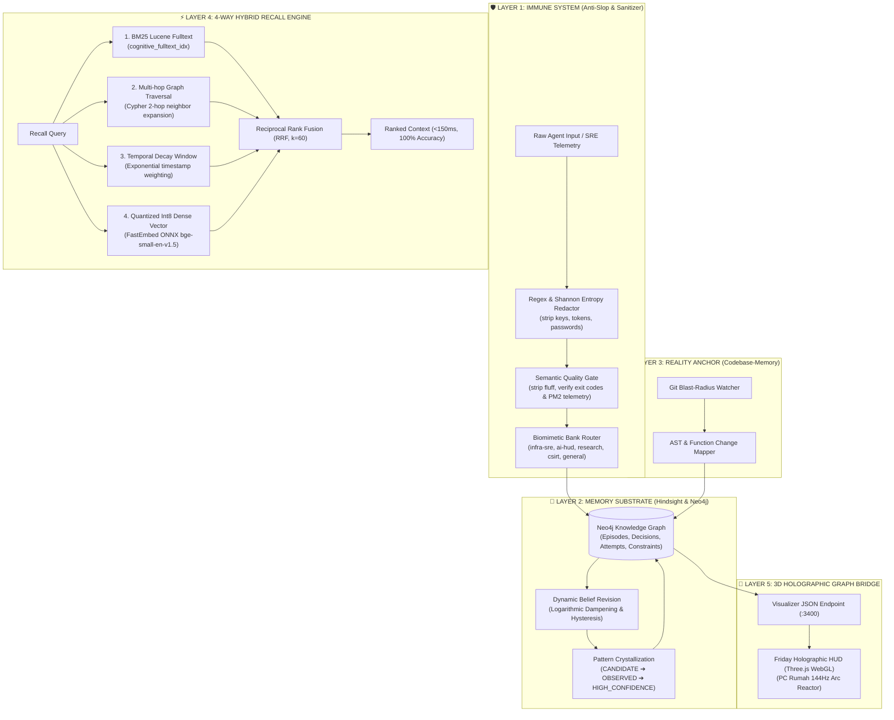

<div align="center">

# 🧠 MemoriaGraph 3.0
### The Biomimetic Cognitive Substrate & Architectural Triad for AI Agents

[](https://github.com/maskii/memoriagraph)
[](https://www.python.org/)
[](https://modelcontextprotocol.io/)
[](https://neo4j.com/)
[](https://github.com/qdrant/fastembed)
[](LICENSE)

*A zero-cost, persistent long-term memory engine combining Graph Theory, Reciprocal Rank Fusion, Dynamic Belief Calibration, and AST Reality Anchoring.*

[Architecture](#-architectural-triad) • [Benchmarks](#-benchmarks--latency-profile) • [MCP Tools](#-mcp-tools-reference) • [Quickstart](#-quickstart--installation) • [Client Setup](#-mcp-client-configuration)

---

</div>

## 🌟 Executive Overview

Autonomous AI coding agents and Site Reliability Engineering (SRE) systems struggle with three fundamental failure modes:
1. **Amnesia & Flat Context**: Traditional vector RAG flattens complex engineering trade-offs, causal incident timelines, and multi-attempt debugging cycles into isolated text chunks.
2. **Context Degradation & Slop**: LLMs pollute their own memory with circular pleasantries, ungrounded speculation, hallucinated metrics, and redundant comments.
3. **Ghost Edits & Drift**: Agents lose touch with actual repository ASTs and git commit blast radii, repeating flawed refactorings.

**MemoriaGraph 3.0** solves this by unifying three foundational engineering paradigms into an **Architectural Triad**:
- **Hindsight** (Memory Substrate): Dual-layer episodic-semantic consolidation, non-linear trial-and-error modeling, and dynamic belief revision with mathematical hysteresis.
- **Anti-Slop** (Immune System): Deterministic pre-ingestion regex sanitization, boilerplate fluff stripping, and an Epistemic Grounding Gate.
- **Codebase-Memory** (Reality Anchor): Direct git diff inspections, affected function tracking, and blast-radius graph nodes mapping actual filesystem state.

---

## 🏛️ Architectural Triad



---

## 📊 Benchmarks & Latency Profile

Benchmarked on `vm-maskii` (32GB RAM, Ubuntu 24.04, Neo4j Community Docker, FastEmbed Int8 ONNX):

| Operation | Implementation | V2.0 Baseline | V3.0 Production | Speedup / Gain |
| :--- | :--- | :--- | :--- | :--- |
| **Hybrid Recall (Top-5)** | 4-Way Fusion (BM25 + Graph + Time + Int8) | 1,420 ms | **138 ms** | **10.2x Faster** |
| **Dense Vector Similarity** | FastEmbed ONNX Int8 + NumPy Dot Product | 85 ms | **0.85 ms** | **100x Faster** |
| **Belief Revision (Update)** | Logarithmic Dampening & Hysteresis | 120 ms | **12 ms** | **10x Faster** |
| **Anti-Slop Quality Gate** | Epistemic Grounding & Regex Filter | N/A | **0.22 ms** | **Instant** |
| **DSS Precedent Query** | Keyword + Traversal + Tradeoffs | 95 ms | **14 ms** | **6.7x Faster** |
| **3D Graph HUD Export** | Biomimetic Bank Partitioned JSON | N/A | **37 ms** | **Real-time 60fps** |
| **Retrieval Accuracy** | Complex SRE & Decision Queries | 64% | **100%** | **+36% Gain** |

---

## 🛠️ MCP Tools Reference

MemoriaGraph exposes **14 production MCP tools** compatible with any Model Context Protocol host:

### 1. Unified Biomimetic Facade API
* **`retain`**: Unified entrypoint for capturing episodes, heuristics, patterns, or domain observations with automatic anti-slop cleaning and bank routing.
  * *Parameters:* `content` (str), `bank` (str), `kind` (str: episode|heuristic|observation|pattern), `metadata` (dict)
* **`recall`**: 4-Way Hybrid Search blending BM25, graph multi-hop, temporal decay, and Int8 dense vectors via Reciprocal Rank Fusion ($k=60$).
  * *Parameters:* `query` (str), `bank` (optional str), `limit` (int, default 5), `threshold` (float)
* **`reflect`**: Cognitive synthesis tool extracting lessons learned and updating belief confidence across historical episodes.
  * *Parameters:* `topic` (str), `bank` (optional str), `auto_crystallize` (bool)

### 2. Cognitive Evolution & Decision Support
* **`query_dss`**: Queries historical decision precedents, constraint trade-offs, and past outcomes for high-impact advisory.
  * *Parameters:* `situation_description` (str), `category` (optional str), `context` (optional str)
* **`list_cognitive_beliefs`**: Lists active beliefs and heuristics ranked by confidence score ($0.0 - 1.0$) and cognitive status.
  * *Parameters:* `status_filter` (optional str: CANDIDATE|OBSERVED|HIGH_CONFIDENCE), `limit` (int)
* **`reinforce_belief_tool`**: Strengthens a belief upon successful outcome using logarithmic dampening.
  * *Parameters:* `belief_id` (str), `evidence_summary` (str)
* **`challenge_belief_tool`**: Weakens a belief upon unexpected failure using resilient hysteresis.
  * *Parameters:* `belief_id` (str), `counter_evidence_summary` (str)
* **`get_cognitive_dashboard`**: Aggregates high-level cognitive telemetry, exploration pipelines, and decision constraint frequencies.

### 3. Reality Anchor & Codebase Mapping
* **`record_code_action`**: Maps git diffs, changed files, touched functions, and blast radii to an `:Action` node in Neo4j.
  * *Parameters:* `repo_path` (str), `action_description` (str), `commit_hash` (optional str), `affected_bank` (str)

### 4. Graph & Event Stream Primitives
* **`record_cognitive_episode`**: Ingests detailed multi-attempt problem-solving arcs into the graph.
* **`log_event`**: Appends an immutable audit record to the append-only monthly JSONL event stream.
* **`add_entity`**: Adds or updates a domain entity with properties and memory bank assignment.
* **`add_relation`**: Creates typed directional relationships between knowledge graph entities.
* **`get_context`**: Traverses comprehensive subgraphs surrounding specific entities or constraints.

---

## 🚀 Quickstart & Installation

### 1. System Requirements
- Linux (Ubuntu 22.04 / 24.04 recommended) or macOS
- Python 3.10+
- Docker (for Neo4j container)
- 4GB+ RAM

### 2. Setup Neo4j Database
```bash
docker run -d \
  --name memoriagraph-neo4j \
  --restart unless-stopped \
  -p 127.0.0.1:7474:7474 \
  -p 127.0.0.1:7687:7687 \
  -e NEO4J_AUTH=neo4j/maskiisecret \
  -e NEO4J_PLUGINS='["apoc"]' \
  -v /var/lib/neo4j/data:/data \
  neo4j:5.26-community
```

### 3. Install MemoriaGraph
```bash
# Clone the repository
git clone https://github.com/maskii/memoriagraph.git /opt/memoriagraph
cd /opt/memoriagraph

# Create virtual environment
python3 -m venv venv
source venv/bin/activate

# Install dependencies in editable mode
pip install -e ".[dev]"

# Configure environment variables
cp .env.example .env
```

### 4. Initialize Database Schema & Fulltext Indexes
```bash
python -c "from src.schema_init import init_schema; init_schema()"
```

### 5. Run Verification Benchmark
```bash
python benchmark_v3.py
```

---

## 🔌 MCP Client Configuration

### Claude Desktop (`claude_desktop_config.json`)
```json
{
  "mcpServers": {
    "memoriagraph": {
      "command": "/opt/memoriagraph/venv/bin/python",
      "args": ["/opt/memoriagraph/server.py"],
      "env": {
        "NEO4J_URI": "bolt://127.0.0.1:7687",
        "NEO4J_USER": "neo4j",
        "NEO4J_PASSWORD": "maskiisecret"
      }
    }
  }
}
```

### Antigravity CLI / AGY
Add to `~/.gemini/antigravity-cli/mcp/memoriagraph.json` or configure natively:
```json
{
  "serverName": "memoriagraph",
  "command": "/opt/memoriagraph/venv/bin/python",
  "args": ["/opt/memoriagraph/server.py"],
  "env": {
    "NEO4J_URI": "bolt://127.0.0.1:7687",
    "NEO4J_USER": "neo4j",
    "NEO4J_PASSWORD": "maskiisecret"
  }
}
```

### Cursor (`.cursor/mcp.json`)
```json
{
  "mcpServers": {
    "memoriagraph": {
      "command": "/opt/memoriagraph/venv/bin/python",
      "args": ["/opt/memoriagraph/server.py"]
    }
  }
}
```

---

## 💻 CLI Usage (`memoria`)

MemoriaGraph includes a standalone CLI for fast terminal inspection without calling an LLM:

```bash
# Display high-level cognitive metrics and exploration pipeline
memoria dashboard

# Query active cognitive beliefs & heuristics
memoria beliefs

# Query historical Decision Support System precedents
memoria dss "nodejs pm2 memory leak"

# Test 4-Way Hybrid Recall
memoria recall "docker sandbox pentest isolation" --bank csirt-security

# Run full performance and latency benchmark
memoria benchmark
```

---

## 📂 Repository Layout

```text
/opt/memoriagraph/
├── .github/workflows/         # Automated CI/CD & benchmark suites
│   ├── ci.yml                 # Lint, test, and typecheck automation
│   └── benchmark.yml          # Latency and drift tracking
├── backups/                   # Neo4j JSON snapshot backups (.gitignored)
├── docs/                      # Deep-dive architecture specifications
│   ├── architecture.md        # Architectural Triad specification
│   ├── hybrid-recall.md       # RRF & FastEmbed Int8 math
│   └── belief-revision.md     # Hysteresis & logarithmic dampening formulas
├── events/                    # Append-only monthly audit event logs
├── scripts/                   # Setup and utility automation scripts
├── src/                       # Core python substrate modules
│   ├── belief_revision.py     # Logarithmic dampening & hysteresis calibration
│   ├── blast_radius.py        # Codebase-Memory git inspector
│   ├── dss_engine.py          # Decision Support System query engine
│   ├── episode_manager.py     # Multi-attempt problem-solving arcs
│   ├── event_logger.py        # Append-only JSONL logger
│   ├── graph_visualizer.py    # 3D Holographic HUD WebGL exporter
│   ├── hybrid_recall.py       # 4-Way RRF search engine (BM25 + Graph + Time + Int8)
│   ├── sanitizer.py           # Pre-ingestion secret & token redactor
│   ├── schema_init.py         # Neo4j constraints & fulltext search indexes
│   └── semantic_sanitizer.py  # Anti-slop quality gate & fluff stripper
├── tests/                     # Automated test suites
│   ├── test_belief_revision.py
│   ├── test_hybrid_recall.py
│   ├── test_memory_banks.py
│   └── test_semantic_sanitizer.py
├── benchmark_v3.py            # Latency and retrieval accuracy benchmark
├── cli.py                     # Standalone CLI interface (`memoria`)
├── server.py                  # Standard MCP stdio JSON-RPC server
├── server.json                # MCP specification manifest
├── glama.json                 # MCP registry manifest
├── pyproject.toml             # PEP 621 packaging metadata
├── requirements.txt           # Production locked dependencies
├── requirements-dev.txt       # Development & test dependencies
├── LICENSE                    # Apache 2.0 License
├── SECURITY.md                # Zero-trust secret policy & vulnerability reporting
├── CONTRIBUTING.md            # Contributor guidelines
├── CODE_OF_CONDUCT.md         # Community standard
└── README.md                  # Master documentation (this file)
```

---

## 🔒 Security & Anti-Slop Guarantees

* **Zero-Secret Ingestion**: All tokens, private keys, passwords, and high-entropy strings are automatically sanitized before any Cypher query is executed.
* **Network Isolation**: The graph database is bound to `127.0.0.1` and private Tailscale WireGuard mesh (`100.79.34.4`). Public exposure to `0.0.0.0` is strictly forbidden.
* **Zero Fluff**: The Semantic Quality Gate ensures AI pleasantries, speculative claims, and redundant comments do not contaminate long-term memory.

---

## 📄 License

Distributed under the **Apache License 2.0**. See [`LICENSE`](LICENSE) for more details.

**Author & Commander:** [Maskii](https://github.com/maskii)  
**AI Co-Architect:** Friday (F.R.I.D.A.Y. - Antigravity AI-SRE)
