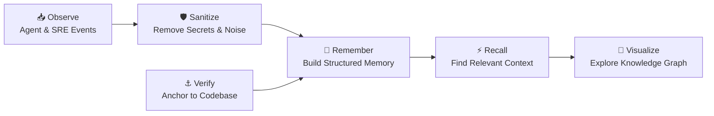
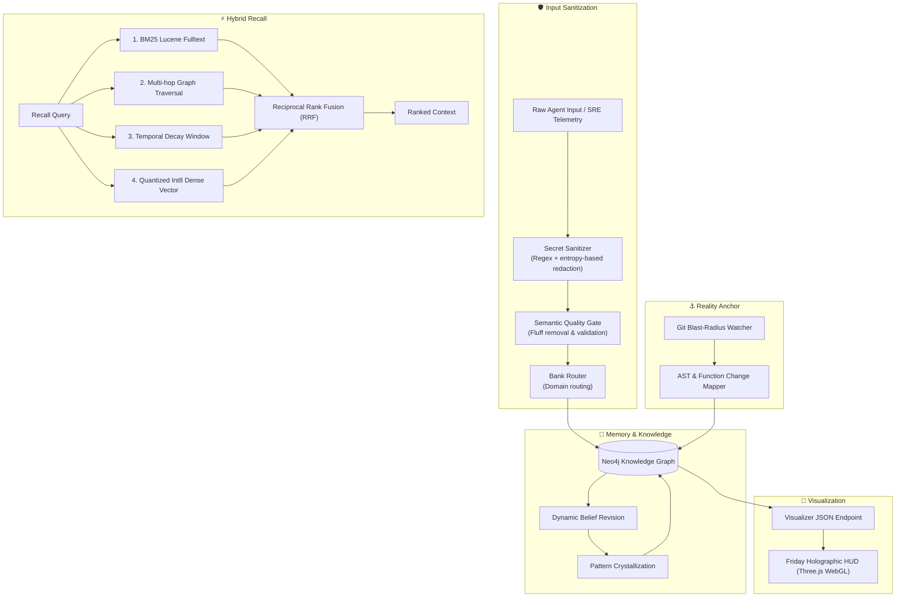

<div align="center">

# 🧠 MemoriaGraph 3.0

[](https://github.com/lhermawan/memoriagraph)
[](https://www.python.org/)
[](https://modelcontextprotocol.io/)
[](https://neo4j.com/)
[](https://github.com/qdrant/fastembed)
[](LICENSE)

*A persistent memory engine for AI agents combining graph-based knowledge, hybrid retrieval, belief revision, and codebase-aware context.*

[What is it?](#-what-is-memoriagraph) • [Features](#-features) • [Quickstart](#-quickstart) • [MCP Tools](#-mcp-integration) • [CLI](#-cli)
</div>

---

## 🧠 What is MemoriaGraph?

MemoriaGraph is a persistent long-term memory system for AI agents and SRE workflows.

It turns operational events, decisions, debugging attempts, observations, and code changes into structured knowledge that can later be recalled. 



---

## 🎯 Why MemoriaGraph?

Autonomous AI coding agents and Site Reliability Engineering (SRE) systems struggle with three fundamental failure modes:

### 1. Amnesia & Flat Context
Traditional vector retrieval can flatten complex engineering history, decisions, constraints, and debugging attempts into isolated text chunks.

### 2. Context Degradation
AI-generated memory can contain noise, redundant text, unsupported claims, or irrelevant conversational content. 

### 3. Codebase Drift
Historical memory can become disconnected from the actual repository state. Agents lose touch with actual repository ASTs and git commit blast radii.

MemoriaGraph addresses these through its Architectural Triad.

---

## 🏛️ Architectural Triad

### 🧠 Hindsight — Memory Substrate
Persistent episodic and semantic memory with dynamic belief revision and pattern crystallization.

### 🛡️ Anti-Slop — Immune System
Sanitizes secrets, removes low-value content, and applies an epistemic/semantic quality gate before information enters long-term memory.

### ⚓ Codebase-Memory — Reality Anchor
Connects memory to Git changes, affected functions, AST-level changes, and blast-radius information.



---

## 🧩 Core Concepts

### Anti-Slop
An immune system that performs deterministic pre-ingestion regex sanitization, boilerplate fluff stripping, and an Epistemic Grounding Gate to prevent AI pleasantries and speculation from contaminating long-term memory.

### Memory Banks
Domain-oriented routing partitions memory into specific domains: `infra-sre`, `ai-hud`, `research`, `csirt`, and `general`.

### Belief Revision
Beliefs can be reinforced or challenged based on evidence. Beliefs dynamically evolve using logarithmic dampening (for reinforcement) and hysteresis (for resilience against failure). The pattern crystallization process moves beliefs from `CANDIDATE` ➔ `OBSERVED` ➔ `HIGH_CONFIDENCE`.

### Reality Anchor
Codebase-Memory connects memory directly to Git diff inspections, affected function tracking, and blast-radius graph nodes mapping the actual filesystem state.

### Hybrid Recall
A 4-way hybrid search engine blending four signals:

| Signal       | Purpose                             |
| ------------ | ----------------------------------- |
| BM25         | Keyword / lexical relevance         |
| Graph        | Relationships and connected context |
| Temporal     | Time-based relevance                |
| Dense Vector | Semantic similarity                 |

These rankings are combined using Reciprocal Rank Fusion (RRF, k=60).

---

## ✨ Features

* 🧠 Persistent Knowledge Graph (Neo4j)
* 🛡️ Secret & Noise Sanitization
* 🔄 Dynamic Belief Revision
* ⚓ Git / AST Reality Anchoring
* ⚡ Four-Way Hybrid Recall
* 🔌 MCP Server (14 Production Tools)
* 💻 Standalone CLI
* 🔮 3D Graph Visualization (Friday Holographic HUD)
* 📊 Benchmarking & Cognitive Telemetry

---

## 🚀 Quickstart

### 1. System Requirements
- Linux (Ubuntu 22.04 / 24.04 recommended) or macOS
- Python 3.10+
- Docker (for Neo4j container)
- 4GB+ RAM

### 2. Setup Neo4j Database
```bash
docker run -d \
  --name memoriagraph-neo4j \
  --restart unless-stopped \
  -p 127.0.0.1:7474:7474 \
  -p 127.0.0.1:7687:7687 \
  -e NEO4J_AUTH=neo4j/your_secure_password \
  -e NEO4J_PLUGINS='["apoc"]' \
  -v /var/lib/neo4j/data:/data \
  neo4j:5.26-community
```

### 3. Install MemoriaGraph
```bash
# Clone the repository
git clone https://github.com/lhermawan/memoriagraph.git /opt/memoriagraph
cd /opt/memoriagraph

# Create virtual environment
python3 -m venv venv
source venv/bin/activate

# Install dependencies in editable mode
pip install -e ".[dev]"

# Configure environment variables
cp .env.example .env
```

### 4. Initialize Database Schema & Fulltext Indexes
```bash
python -c "from src.schema_init import init_schema; init_schema()"
```

### 5. Run Verification Benchmark
```bash
python benchmark_v3.py
```

*What happens next?* You can use the `memoria` CLI to interact with your graph or connect your preferred AI agent via MCP.

---

## 🔌 MCP Integration

MemoriaGraph exposes **14 production MCP tools** compatible with any Model Context Protocol host:

| Capability       | Tools                         | Purpose                        |
| ---------------- | ----------------------------- | ------------------------------ |
| Memory           | `retain`, `recall`, `reflect` | Store and retrieve knowledge   |
| Decision Support | `query_dss`                   | Historical precedents          |
| Beliefs          | `list_cognitive_beliefs`, `reinforce_belief_tool`, `challenge_belief_tool`, `get_cognitive_dashboard` | Confidence evolution           |
| Codebase         | `record_code_action`          | Connect memory to code changes |
| Graph            | `add_entity`, `add_relation`, `get_context` | Graph operations               |
| Events           | `record_cognitive_episode`, `log_event` | Operational history            |

### Detailed API Reference

#### 1. Unified Biomimetic Facade API
* **`retain`**: Unified entrypoint for capturing episodes, heuristics, patterns, or domain observations with automatic anti-slop cleaning and bank routing.
* **`recall`**: 4-Way Hybrid Search blending BM25, graph multi-hop, temporal decay, and Int8 dense vectors via Reciprocal Rank Fusion.
* **`reflect`**: Cognitive synthesis tool extracting lessons learned and updating belief confidence across historical episodes.

#### 2. Cognitive Evolution & Decision Support
* **`query_dss`**: Queries historical decision precedents, constraint trade-offs, and past outcomes for high-impact advisory.
* **`list_cognitive_beliefs`**: Lists active beliefs and heuristics ranked by confidence score ($0.0 - 1.0$) and cognitive status.
* **`reinforce_belief_tool`**: Strengthens a belief upon successful outcome using logarithmic dampening.
* **`challenge_belief_tool`**: Weakens a belief upon unexpected failure using resilient hysteresis.
* **`get_cognitive_dashboard`**: Aggregates high-level cognitive telemetry, exploration pipelines, and decision constraint frequencies.

#### 3. Reality Anchor & Codebase Mapping
* **`record_code_action`**: Maps git diffs, changed files, touched functions, and blast radii to an `:Action` node in Neo4j.

#### 4. Graph & Event Stream Primitives
* **`record_cognitive_episode`**: Ingests detailed multi-attempt problem-solving arcs into the graph.
* **`log_event`**: Appends an immutable audit record to the append-only monthly JSONL event stream.
* **`add_entity`**: Adds or updates a domain entity with properties and memory bank assignment.
* **`add_relation`**: Creates typed directional relationships between knowledge graph entities.
* **`get_context`**: Traverses comprehensive subgraphs surrounding specific entities or constraints.

---

## 💻 CLI Usage (`memoria`)

MemoriaGraph includes a standalone CLI for fast terminal inspection without calling an LLM:

```bash
# Display high-level cognitive metrics and exploration pipeline
memoria dashboard

# Query active cognitive beliefs & heuristics
memoria beliefs

# Query historical Decision Support System precedents
memoria dss "nodejs pm2 memory leak"

# Test 4-Way Hybrid Recall
memoria recall "docker sandbox pentest isolation" --bank csirt-security

# Run full performance and latency benchmark
memoria benchmark
```

---

## 📊 Benchmarks

*Note: Retrieval accuracy reflects the project's internal benchmark suite and should not be interpreted as universal retrieval accuracy.*

Benchmarked on `vm-maskii` (32GB RAM, Ubuntu 24.04, Neo4j Community Docker, FastEmbed Int8 ONNX):

| Operation | Implementation | V2.0 Baseline | V3.0 Production | Speedup / Gain |
| :--- | :--- | :--- | :--- | :--- |
| **Hybrid Recall (Top-5)** | 4-Way Fusion (BM25 + Graph + Time + Int8) | 1,420 ms | **138 ms** | **10.2x Faster** |
| **Dense Vector Similarity** | FastEmbed ONNX Int8 + NumPy Dot Product | 85 ms | **0.85 ms** | **100x Faster** |
| **Belief Revision (Update)** | Logarithmic Dampening & Hysteresis | 120 ms | **12 ms** | **10x Faster** |
| **Anti-Slop Quality Gate** | Epistemic Grounding & Regex Filter | N/A | **0.22 ms** | **Instant** |
| **DSS Precedent Query** | Keyword + Traversal + Tradeoffs | 95 ms | **14 ms** | **6.7x Faster** |
| **3D Graph HUD Export** | Biomimetic Bank Partitioned JSON | N/A | **37 ms** | **Real-time 60fps*** |
| **Retrieval Accuracy** | Complex SRE & Decision Queries | 64% | **100%** | **+36% Gain** |

*( * 37ms JSON export latency facilitates a 60 FPS rendering target in the visualization layer. )*

---

## 🔮 Friday Holographic HUD

The visualization layer consumes the graph visualization endpoint and renders the knowledge graph using Three.js/WebGL.

```text
Neo4j
  ↓
Graph Exporter
  ↓
Visualizer JSON API
  ↓
Friday Holographic HUD
  ↓
Three.js / WebGL
```

---

## 📂 Repository Structure

```text
/opt/memoriagraph/
├── .github/workflows/         # CI/CD automation & benchmark suites
├── backups/                   # Neo4j JSON snapshot backups (.gitignored)
├── docs/                      # Technical deep-dives
│   ├── architecture.md        # Architectural Triad specification
│   ├── hybrid-recall.md       # RRF & FastEmbed Int8 math
│   └── belief-revision.md     # Hysteresis & dampening formulas
├── events/                    # Append-only audit event logs
├── scripts/                   # Setup automation scripts
├── src/                       # Core python substrate modules
│   ├── belief_revision.py     # Dampening & hysteresis calibration
│   ├── blast_radius.py        # Codebase-Memory git inspector
│   ├── dss_engine.py          # Decision Support System
│   ├── episode_manager.py     # Multi-attempt problem-solving arcs
│   ├── event_logger.py        # JSONL logger
│   ├── graph_visualizer.py    # JSON exporter for HUD
│   ├── hybrid_recall.py       # 4-Way RRF search engine
│   ├── sanitizer.py           # Pre-ingestion redactor
│   ├── schema_init.py         # Neo4j constraints & indexes
│   └── semantic_sanitizer.py  # Anti-slop quality gate
├── tests/                     # Automated test suites
├── benchmark_v3.py            # Latency and retrieval accuracy benchmark
├── cli.py                     # Standalone CLI (`memoria`)
├── server.py                  # Standard MCP stdio JSON-RPC server
├── server.json                # MCP specification manifest
├── pyproject.toml             # Python packaging metadata
└── README.md                  # Master documentation (this file)
```

---

## 🔒 Security

Security measures and anti-slop design principles:

* **Zero-Secret Ingestion**: All tokens, private keys, passwords, and high-entropy strings are automatically sanitized before any Cypher query is executed.
* **Network Isolation**: By default, the graph database binds exclusively to `127.0.0.1` (localhost). Exposing Neo4j directly to the public internet (`0.0.0.0`) is strictly discouraged.
* **Zero Fluff**: The Semantic Quality Gate filters out AI pleasantries, speculative claims, and redundant comments.

---

## 🌐 Deployment

MemoriaGraph supports two deployment modes:

### Mode 1: Localhost (Default — Single Machine)
Connect directly to `bolt://127.0.0.1:7687`. Zero configuration required.

### Mode 2: Multi-Node Mesh with Tailscale (Optional)
Connect from multiple remote devices securely without opening public ports using a WireGuard mesh VPN.

1. **Install Tailscale** on your Host Server (where Neo4j runs).
2. **Retrieve your Server's Private Mesh IP**: `tailscale ip -4` (e.g., `100.x.y.z`).
3. **Bind Neo4j** to your Tailscale IP:
   ```bash
   docker run -d \
     --name memoriagraph-neo4j \
     --restart unless-stopped \
     -p 127.0.0.1:7687:7687 \
     -p 100.x.y.z:7687:7687 \
     -e NEO4J_AUTH=neo4j/your_secure_password \
     -v /var/lib/neo4j/data:/data \
     neo4j:5.26-community
   ```
4. **Connect Remote Clients**: Update client configuration to use `bolt://100.x.y.z:7687`.

#### Client Configurations

**Claude Desktop** (`claude_desktop_config.json`):
```json
{
  "mcpServers": {
    "memoriagraph": {
      "command": "/opt/memoriagraph/venv/bin/python",
      "args": ["/opt/memoriagraph/server.py"],
      "env": {
        "NEO4J_URI": "bolt://100.x.y.z:7687",
        "NEO4J_USER": "neo4j",
        "NEO4J_PASSWORD": "your_secure_password"
      }
    }
  }
}
```

**Antigravity CLI / AGY** (`~/.gemini/antigravity-cli/mcp/memoriagraph.json`):
```json
{
  "serverName": "memoriagraph",
  "command": "/opt/memoriagraph/venv/bin/python",
  "args": ["/opt/memoriagraph/server.py"],
  "env": {
    "NEO4J_URI": "bolt://100.x.y.z:7687",
    "NEO4J_USER": "neo4j",
    "NEO4J_PASSWORD": "your_secure_password"
  }
}
```

**Cursor** (`.cursor/mcp.json`):
```json
{
  "mcpServers": {
    "memoriagraph": {
      "command": "/opt/memoriagraph/venv/bin/python",
      "args": ["/opt/memoriagraph/server.py"]
    }
  }
}
```

---

## 📚 Documentation

- [Panduan Pelatihan & Adopsi Instansi (Bahasa Indonesia)](docs/PANDUAN_PELATIHAN_INSTANSI.md)
- [Institutional Training Guide (English)](docs/training-guide.md)
- [Architecture](docs/architecture.md)
- [Hybrid Recall](docs/hybrid-recall.md)
- [Belief Revision](docs/belief-revision.md)
- [Security](SECURITY.md)
- [Contributing](CONTRIBUTING.md)

*(Note: Additional MCP tools reference is covered in the [MCP Integration](#-mcp-integration) section.)*

---

## 📄 License

Distributed under the **Apache License 2.0**. See [`LICENSE`](LICENSE) for more details.

**Author & Commander:** [Maskii (Lucky Hermawan)](https://github.com/lhermawan)  
**AI Co-Architect:** Friday (F.R.I.D.A.Y. - Antigravity AI-SRE)
