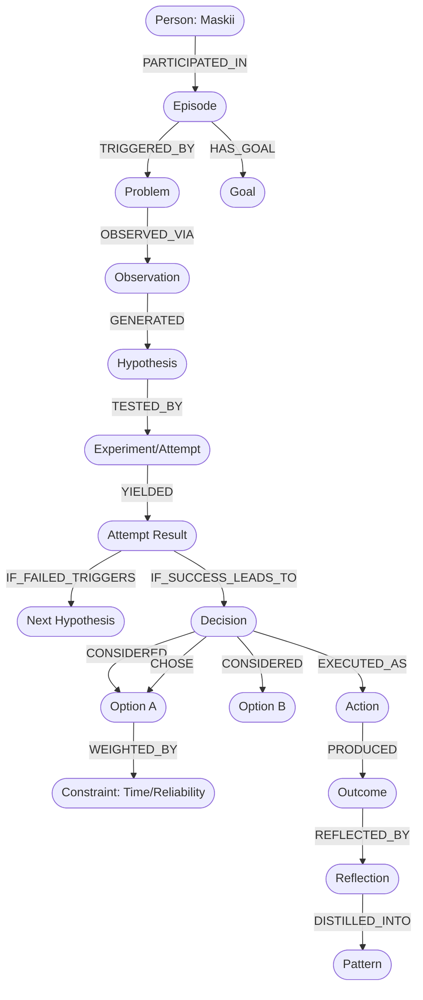

# 🧠 MEMORIAGRAPH 2.0: Cognitive Process & Personal Decision Intelligence Upgrade
> **Status:** 🟢 LIVE ACTIVE RESEARCH & OBSERVATION WINDOW  
> **Periode Riset Bulan 1:** 26 September 2026 – 26 Oktober 2026  
> **Target Evaluasi Milestone 1:** 26 Oktober 2026  
> **Target System:** Neo4j Local Instance (`memoriagraph-neo4j`) & `/opt/memoriagraph`  
> **Author:** Maskii  
> **AI Architecture Partner:** Friday (Antigravity AI-SRE)  
> **Version:** 2.0.0 (Phase 1 & 2 Deployed)

---

### 📅 Agenda Riset Terdekat:
- [ ] **Eksperimen 1: Strix AI Security & n8n Integration** *(Jadwal: Senin, 28 September 2026)*
  - [ ] Setup sandbox Docker Strix di `vm-maskii`.
  - [ ] Konfigurasi LLM backend menggunakan Google AI Studio (**Gemini Flash API**).
  - [ ] Pengujian terisolasi pada target lokal / container testbed.
  - [ ] Uji integrasi pelaporan otomatis ke n8n (port 5678).
- [ ] **Eksperimen 2: AI YouTube Clipper 100% Free / Zero-Cost** *(Jadwal: Senin, 28 September 2026)*
  - [ ] Rancang pipeline automasi kliping video YouTube tanpa biaya API berbayar.
  - [ ] Evaluasi opsi arsitektur: **n8n workflow** (`yt-dlp` + Gemini Flash Free Tier + `ffmpeg`) vs **Slendro AI**.
  - [ ] Alur kerja: Download audio/sub $\to$ Deteksi viral hook/highlight dengan Gemini $\to$ Auto-crop/cut format 9:16 (Shorts/TikTok/Reels).
  - *(⏰ Pengingat otomatis via WhatsApp untuk kedua agenda dijadwalkan pada Senin, 28 Sep 2026 jam 08:00 WIB)*.

## 📌 DAFTAR ISI & ROADMAP TRACKER

- [x] **Phase 1 — Data Capture & Ingestion Foundation** *(Status: Selesai Diimplementasi & Teruji)*
  - [x] Implementasi Regex & Entropy Secret Redaction Engine (`src/sanitizer.py`).
  - [x] Pembuatan schema append-only JSONL event stream (`/opt/memoriagraph/events/YYYY-MM.jsonl`).
  - [x] Integrasi Noise Filter & Relevancy Gate (`src/event_logger.py`).
  - [x] Pencatatan dasar `Episode`, `Event`, `Context`, `Timestamp`, dan `Source`.
- [x] **Phase 2 — Cognitive Structure & Graph Modeling** *(Status: Selesai Diimplementasi & Teruji)*
  - [x] Pembuatan Constraint & Index label Neo4j (`Episode`, `Problem`, `Decision`, `Action`, `Outcome`, dll via `schema_init.py`).
  - [x] Pemisahan Label Epistemologis (`:Fact`, `:Observation`, `:Inference`, `:Hypothesis`, `:AiGenerated`).
  - [x] Dukungan siklus non-linear trial-and-error (`Attempt 1 -> Fail -> Attempt 2 -> Success` via `episode_manager.py`).
  - [x] Pemodelan Decision Graph (Constraints, Options, Tradeoffs).
  - [x] Pemodelan Exploration Arc (`Curiosity -> Discovery -> Prototype -> Project`).
  - [x] Pembuatan CLI global `memoria` (`dashboard`, `dss`, `episodes`) dan upgrade MCP Server (`server.py`).
- [ ] **Phase 3 — Pattern Mining & Confidence Engine** *(Target: Bulan 1)*
  - [ ] Implementasi status bertingkat (`OBSERVED` -> `CANDIDATE` -> `REPEATED` -> `HIGH_CONFIDENCE`).
  - [ ] Analisis temporal week-over-week (kecepatan keputusan, recovery failure rate).
  - [ ] Mesin induksi rule asosiasi berbasis data historis (tanpa manual rule).
- [ ] **Phase 4 — Personal Decision Support System (DSS)** *(Target: Bulan 2)*
  - [ ] Tool context matching & historical retrieval (vektor & graph similarity).
  - [ ] Fitur Counterfactual Analysis (membandingkan Outcome historis Opsi A vs Opsi B).
  - [ ] Penyajian bukti historis obyektif (advisory evidence, non-prescriptive).
- [ ] **Phase 5 — Cognitive Dashboard & 2-Month Milestone Review** *(Target: Akhir Bulan 2)*
  - [ ] Dashboard visual statistik observasi (Problem Solving, Exploration, Habit, Reversals).
  - [ ] Evaluasi 8 Pertanyaan Kunci Kognitif.
  - [ ] Pondasi eksperimen Personal Cognitive Model / Digital Twin tahap lanjut.

---

## 1. VISI SISTEM

MemoriaGraph berevolusi dari sekadar sistem memori statis (*"Apa yang pernah dilakukan?"*) menjadi sistem observasi dan analisis mendalam terhadap **proses berpikir, problem-solving, eksplorasi, dan pengambilan keputusan personal Maskii** (*"Bagaimana prosesnya, mengapa keputusan tersebut diambil, dan apa dampaknya?"*).

```
Memory ──▶ Context ──▶ Problem ──▶ Investigation ──▶ Hypothesis ──▶ Experiment
                                                                        │
Pattern ◀── Reflection ◀── Outcome ◀── Action ◀── Decision ◀────────────┘
```

**Target Jangka Panjang:**  
Membentuk **Personal Cognitive Model** yang menggambarkan pola eksplorasi, heuristik pemecahan masalah, dan intuisi pengambilan keputusan berdasarkan data empiris nyata, bukan asumsi teoretis.

---

## 2. PRINSIP UTAMA: MENANGKAP PROSES, BUKAN HANYA HASIL

Sistem dilarang keras hanya mencatat hasil akhir (misal: *"Maskii memperbaiki tool Nuclei"*). Setiap episode kognitif wajib menangkap rantai penalaran:

| Tahap | Contoh Nyata |
| :--- | :--- |
| **Problem** | Tool `nuclei` tidak dapat dijalankan dari terminal. |
| **Observation** | Shell menampilkan error `command not found: nuclei`. |
| **Investigation** | Memeriksa variabel `$PATH` dan direktori binary Go `$(go env GOPATH)/bin`. |
| **Hypothesis** | Binary sudah terinstall namun direktori `bin` Go belum masuk ke `$PATH`. |
| **Action** | Menambahkan `export PATH="$PATH:$(go env GOPATH)/bin"` ke `~/.bashrc`. |
| **Decision** | Memilih edit permanen di `~/.bashrc` daripada export sementara di sesi bash aktif. |
| **Verification** | Membuka shell baru dan mengeksekusi `nuclei -version`. |
| **Outcome** | `SUCCESS` — command dikenali dan berjalan normal. |

---

## 3. TUJUAN ANALITIK UPGRADE

Sistem harus mampu menjawab pertanyaan reflektif berikut secara obyektif melalui query data:

### A. Problem Solving
1. Bagaimana gaya Maskii dalam memecahkan masalah sistem/infrastruktur?
2. Tindakan apa yang paling sering dilakukan pertama kali (cek log, langsung coba CLI, atau cari dokumentasi)?
3. Apa yang dilakukan ketika solusi pertama gagal (ganti pendekatan, periksa dependensi, atau re-install)?
4. Seberapa sering menggunakan pendekatan *trial-and-error* versus *analisis mendalam* sebelum eksekusi?

### B. Decision Making
1. Faktor kendala (*constraints*) apa yang paling dominan memengaruhi keputusan (waktu, budget, risiko, reliabilitas, atau maintainability)?
2. Apakah keputusan dibuat setelah membandingkan minimal 2 opsi atau langsung opsi pertama?
3. Seberapa sering terjadi *decision reversal* (pembatalan keputusan) setelah data baru muncul?

### C. Exploration
1. Bagaimana rasa penasaran (*curiosity*) bertransformasi menjadi eksperimen dan proyek nyata?
2. Berapa rasio konversi ide eksperimen menjadi implementasi produksi?
3. Topik teknologi apa yang paling sering memicu eksplorasi lanjutan?

### D. Evolution
1. Apakah pola problem-solving menjadi lebih efisien seiring bertambahnya waktu?
2. Apakah pengambilan keputusan menjadi lebih terstruktur dan minim trial-and-error yang gagal?

---

## 4. MODEL DATA: EPISODE-BASED MEMORY

Satu **Episode** merepresentasikan satu rangkaian aktivitas utuh yang memiliki konteks dan tujuan terikat:

```
Episode
 ├── Context (Infrastruktur / Development / Security / Otomasi)
 ├── Trigger (Incident SRE, rasa penasaran baru, task deployment)
 ├── Goal (Objektif yang ingin dicapai)
 ├── Problem (Hambatan atau tantangan)
 ├── Observation (Fakta yang diamati di lapangan)
 ├── Investigation (Langkah penelusuran data)
 ├── Hypothesis (Dugaan penyebab)
 ├── Experiment (Pengujian hipotesis)
 ├── Decision (Pilihan yang diambil beserta alasannya)
 ├── Action (Perintah/kode yang dieksekusi)
 ├── Outcome (Hasil akhir & evaluasi)
 ├── Reflection (Pelajaran yang disimpulkan)
 └── Follow-up (Tindakan preventif lanjutan)
```

---

## 5. ENTITAS UTAMA NEO4J (LABELS & PROPERTIES)

### 1. `Person`
- `id`: String (e.g. `"maskii"`)
- `name`: String

### 2. `Episode`
- `id`: String (e.g. `"EP-20260926-001"`)
- `title`: String
- `category`: String (`"PROBLEM_SOLVING"`, `"EXPLORATION"`, `"INFRA_SETUP"`, dll)
- `timestamp_start`: DateTime
- `timestamp_end`: DateTime
- `objective`: String
- `status`: String (`"RESOLVED"`, `"IN_PROGRESS"`, `"ABANDONED"`)
- `confidence`: Float (0.0 – 1.0)

### 3. `Problem`
- `id`: String
- `description`: String
- `category`: String
- `severity`: String (`"LOW"`, `"MEDIUM"`, `"HIGH"`, `"CRITICAL"`)
- `detected_at`: DateTime

### 4. `Observation`
- `id`: String
- `description`: String
- `source`: String (`"bash_output"`, `"syslog"`, `"pm2_log"`, `"chat"`)
- `timestamp`: DateTime

### 5. `Hypothesis`
- `id`: String
- `description`: String
- `confidence`: Float
- `status`: String (`"PENDING"`, `"VALIDATED"`, `"REFUTED"`)

### 6. `Experiment` / `Attempt`
- `id`: String
- `attempt_number`: Integer
- `description`: String
- `command_or_code`: String
- `timestamp`: DateTime
- `result`: String

### 7. `Decision`
- `id`: String
- `description`: String
- `timestamp`: DateTime
- `rationale`: String
- `confidence`: Float

### 8. `Constraint`
- `id`: String
- `category`: String (`"TIME"`, `"BUDGET"`, `"RELIABILITY"`, `"RISK"`, `"EFFORT"`, `"COMPATIBILITY"`)
- `weight`: Float (1.0 – 5.0)

### 9. `Action`
- `id`: String
- `description`: String
- `tool_used`: String
- `timestamp`: DateTime

### 10. `Outcome`
- `id`: String
- `status`: String (`"SUCCESS"`, `"PARTIAL_SUCCESS"`, `"FAILED"`, `"DEFERRED"`, `"ABANDONED"`)
- `time_to_result_seconds`: Integer
- `effort_level`: String (`"LOW"`, `"MEDIUM"`, `"HIGH"`)
- `side_effects`: String

### 11. `Reflection`
- `id`: String
- `description`: String
- `epistemic_status`: String (`"OBSERVED"`, `"INFERRED"`, `"GENERATED"`)
- `timestamp`: DateTime

### 12. `Pattern`
- `id`: String
- `rule_statement`: String
- `support_count`: Integer
- `confidence_level`: String (`"OBSERVED"`, `"CANDIDATE"`, `"REPEATED"`, `"HIGH_CONFIDENCE"`)

---

## 6. RELATIONSHIP GRAPH SCHEMA



---

## 7. DECISION GRAPH ARCHITECTURE

Setiap keputusan penting dapat direkonstruksi ke dalam sub-graph:
$$\text{Context} \to \text{Problem} \to \text{Constraints} \to \text{Options} \to \text{Considerations} \to \text{Decision} \to \text{Action} \to \text{Outcome}$$

* **Constraints Tracked**:
  - `Time` (Tenggat waktu sempit / santai)
  - `Risk` (Potensi downtime production)
  - `Effort` (Baris kode, waktu implementasi)
  - `Reliability` (Stabilitas jangka panjang)
  - `Compatibility` (Kesesuaian stack existing)
* **Aturan Pengolahan Data**:
  Simpan data mentah terlebih dahulu. Jangan memaksakan pembobotan skor numerik (*scoring*) jika data awal belum mencukupi.

---

## 8. PROBLEM-SOLVING EPISODE (NON-LINEAR LOOPS)

Problem-solving di dunia nyata tidak selalu garis lurus. Sistem wajib mendukung **Siklus Trial-and-Error Multi-Attempt**:

```
Problem Detected
       │
       ▼
[Attempt 1] ──▶ FAILED ──▶ New Observation & Refinement
                                 │
                                 ▼
[Attempt 2] ◀────────────────────┘
       │
       ▼
    FAILED ──▶ New Hypothesis ──▶ [Attempt 3] ──▶ SUCCESS ──▶ Resolution
```

Metrik Siklus:
- `attempts_count`: Jumlah percobaan sebelum masalah selesai.
- `failure_recovery_latency`: Durasi dari kegagalan pertama hingga menemukan solusi kerja.

---

## 9. EXPLORATION EPISODE (CURIOSITY TO PROJECT ARC)

Mendeteksi bagaimana ide divergen berevolusi menjadi implementasi konvergen:

```
UNKNOWN ──▶ CURIOSITY ──▶ QUESTION ──▶ EXPLORATION ──▶ DISCOVERY
                                                          │
PROJECT ◀── FEATURE/PROTOTYPE ◀── EXPERIMENT ◀────────────┘
```

*Contoh Kasus Riil Server:*
1. **Curiosity**: *"Bisakah sistem monitoring memanggil agent via script lokal?"*
2. **Experiment**: Membuat script `patrol-hub.js` dengan otentikasi Ed25519.
3. **Prototype**: Menghubungkan ke endpoint WhatsApp port 3200.
4. **Project**: Membangun **AI-SRE Watchdog Hub** mandiri di `vm-maskii`.

---

## 10. EVENT LOGGING STREAM SPECIFICATION

Setiap aktivitas dicatat sebagai event terstruktur di log lokal (JSON Lines) sebelum diproyeksikan ke graph:

```json
{
  "event_id": "evt-20260926-00123",
  "event_type": "decision",
  "timestamp": "2026-09-26T18:00:00+07:00",
  "episode_id": "EP-20260926-004",
  "context": "server-monitoring",
  "description": "Memilih menggunakan Telegram sebagai interface sekunder",
  "reasons": [
    "mudah diakses dari HP",
    "sudah tersedia bot framework",
    "mendukung webhook automation"
  ],
  "confidence": 0.85,
  "epistemic_class": "OBSERVED"
}
```

**Daftar Tipe Event Minimal:**
`question`, `observation`, `search`, `discovery`, `problem`, `hypothesis`, `experiment`, `decision`, `action`, `failure`, `success`, `reflection`, `idea`, `project`.

---

## 11. NOISE FILTERING & RELEVANCY GATE

Mencegah polusi memori dari percakapan santai atau eksekusi perintah sepele:

```
RAW_EVENT (Chat/Shell)
        │
        ▼
   [Is Relevant?]
   ├── NO  ──▶ CONVERSATIONAL_NOISE (Abaikan / Jangan simpan ke MemoriaGraph)
   │           Contoh: "wkwk oke", "siap", "clear screen"
   │
   └── YES ──▶ CLASSIFY & INGEST
               ├── Memory (Fakta sistem permanen)
               ├── Decision (Pemilihan arsitektur / langkah)
               └── Episode (Rangkaian problem solving / eksplorasi)
```

---

## 12. EPISTEMOLOGICAL CONFIDENCE SYSTEM

Mencegah kesimpulan prematur (*premature conclusion bias*):

| Status Keyakinan | Jumlah Observasi Empiris | Keterangan |
| :--- | :---: | :--- |
| `OBSERVED` | 1 – 2 kali | Kejadian tunggal, belum ada bukti pola. |
| `CANDIDATE PATTERN` | 3 – 5 kali | Mulai memperlihatkan kecenderungan berulang. |
| `REPEATED PATTERN` | 6 – 14 kali | Pola terverifikasi sering terjadi. |
| `HIGH CONFIDENCE PATTERN` | $\ge 15$ kali | Heuristik inti yang sangat stabil dan terbukti. |

*Contoh:*
- Observasi 3x: *"Maskii cenderung melakukan tes langsung di terminal."* $\to$ Status: `CANDIDATE PATTERN` (Confidence: Low/Medium).
- Observasi 27x: $\to$ Status: `HIGH CONFIDENCE PATTERN`.

---

## 13. TEMPORAL ANALYSIS & COGNITIVE EVOLUTION

Membandingkan metrik perkembangan kognitif antar periode (Minggu ke Minggu / Bulan ke Bulan):

*Contoh Laporan Analisis Evolusi:*
```
📊 COGNITIVE PROCESS EVOLUTION REPORT (Month 1 vs Month 2)
━━━━━━━━━━━━━━━━━━━━━━━━━━━━━━━━━━━━━━━━━━━━━━━━━━━━━━━━━
1. Problem Solving Approach:
   • Month 1: Explore ──▶ Trial CLI ──▶ Debug Log (Rata-rata 4.2 percobaan)
   • Month 2: Observe Log ──▶ Diagnose ──▶ Targeted Patch (Rata-rata 1.8 percobaan)
   * Potential Pattern: Proses diagnosa menjadi lebih eksplisit dan tenang di awal.

2. Decision Latency:
   • Rata-rata durasi penentuan opsi turun sebesar 34%.

3. Failure Recovery:
   • 80% insiden terselesaikan pada hipotesis pertama.
```
*Catatan:* Selalu gunakan istilah **"Potential Pattern"**, bukan vonis mutlak.

---

## 14. OUTCOME TRACKING & ATTRIBUTION

Menghubungkan keputusan historis dengan dampak nyata:

* **Tipe Outcome**:
  - `SUCCESS`: Berhasil penuh sesuai target.
  - `PARTIAL_SUCCESS`: Berhasil dengan catatan atau penyesuaian.
  - `FAILED`: Gagal mencapai target.
  - `ABANDONED`: Dibatalkan karena prioritas berubah atau tidak layak diteruskan.
  - `DEFERRED`: Ditunda ke waktu lain.
  - `UNKNOWN`: Hasil belum dapat diverifikasi.
* **Metrik Dampak yang Dicatat**:
  - `time_to_result`
  - `effort_level`
  - `side_effects`
  - `follow_up_required`

---

## 15. REFLECTION LAYER & STATUS LABELS

Setiap refleksi pasca-episode wajib diberi label epistemologis:
* `OBSERVED`: Fakta yang benar-benar tercatat terjadi secara fisik.
* `INFERRED`: Kesimpulan logis yang ditarik dari beberapa fakta terhubung.
* `GENERATED`: Analisis sintetis yang diusulkan oleh AI.

Tujuannya agar **fakta** dan **interpretasi AI** tidak pernah tercampur aduk.

---

## 16. PERSONAL DECISION SUPPORT SYSTEM (DSS)

Ketika Maskii menghadapi masalah atau situasi baru di masa depan:

```
[Situasi Saat Ini] ──▶ Historical Retrieval ──▶ Pattern Detection ──▶ Context Matching ──▶ Personal DSS
```

*Contoh Output Interaktif:*
```
🧠 PERSONAL DSS EVIDENCE REPORT
━━━━━━━━━━━━━━━━━━━━━━━━━━━━━
Situasi Saat Ini:
Project baru dengan deadline sangat sempit (< 24 jam).

Histori Kasus Serupa:
14 Episode terdeteksi di database.

Pendekatan Paling Sering:
Menggunakan kembali komponen yang sudah ada (Reuse Existing Stack).

Alasan Historis yang Tercatat:
• Kendala waktu ketat
• Beban implementasi lebih rendah
• Kemudahan maintenance

Hasil Historis:
• Berhasil Penuh : 10 kasus (71.4%)
• Berhasil Parsial: 3 kasus (21.4%)
• Gagal          : 1 kasus (7.2%)

⚠️ Catatan: Ini adalah bukti historis murni berdasarkan data masa lalu, bukan perintah/rekomendasi mutlak.
```

---

## 17. TARGET METRIK 2 BULAN (BENCHMARK KOGNITIF)

Setelah sistem berjalan selama 60 hari, metrik berikut akan diekstraksi secara otomatis:

1. **Problem Solving**:
   - Rata-rata jumlah percobaan per masalah.
   - Distribusi tindakan pertama (*first action distribution*).
   - Pola pemulihan kegagalan (*failure recovery patterns*).
   - Frekuensi verifikasi sebelum menyatakan selesai.
2. **Decision Making**:
   - *Decision latency* (durasi dari kemunculan masalah hingga aksi pertama).
   - Rata-rata jumlah opsi yang dipertimbangkan.
   - Faktor keputusan paling dominan.
   - Persentase revisi/pembatalan keputusan.
3. **Exploration**:
   - Jumlah pertanyaan/curiosity yang diajukan.
   - Jumlah eksperimen yang dieksekusi.
   - Rasio konversi ide menjadi proyek.
4. **Learning & Knowledge Reuse**:
   - Masalah berulang yang berhasil diselesaikan dengan solusi serupa.
   - Pendekatan yang dulu pernah gagal dan kini dihindari.
   - Pengetahuan baru yang diadopsi dan diintegrasikan.

---

## 18. PATTERN MINING BERBASIS DATA (TANPA MANUAL RULES)

Sistem menemukan aturan asosiasi dari grafik historis secara induktif:

$$\text{IF } [\text{context} = \text{technical\_problem} \land \text{information} = \text{incomplete}] \implies [\text{Exploration/CLI testing meningkat}]$$
$$\text{IF } [\text{deadline} = \text{short} \land \text{existing\_solution} = \text{available}] \implies [\text{Reuse frequency} = 85\%]$$

Aturan ini ditambang langsung dari frekuensi data Neo4j, bukan diketik manual oleh manusia.

---

## 19. COUNTERFACTUAL ANALYSIS (KOMPARASI HISTORIS)

Membandingkan dua opsi di masa lalu berdasarkan bukti empiris:

```
Situasi: "Membuat sistem antrian pesan"
  ├── Option A (Custom worker script)
  │    └── Histori: 8 kasus | Rata-rata waktu: 6 jam | Maintenance issue: 3x
  └── Option B (BullMQ / Redis / N8N existing)
       └── Histori: 13 kasus | Rata-rata waktu: 45 menit | Maintenance issue: 0x
```

Menjawab pertanyaan: *"Apa yang secara nyata pernah terjadi ketika saya memilih A dibanding B?"*

---

## 20. PERSONAL COGNITIVE DASHBOARD (STATISTIK OBSERVASI)

Format visualisasi statistik tanpa penilaian moral/karakter:

```
🧠 PERSONAL COGNITIVE DASHBOARD
━━━━━━━━━━━━━━━━━━━━━━━━━━━━
Problem Solving Rate : ████████████████░░ 82% (Resolved vs Total)
Exploration Index    : ██████████████░░░░ 71% (Curiosity Events)
Experimentation Rate : ████████████████░░ 79% (Hypotheses Tested)
Decision Reversals   : ████░░░░░░░░░░░░░░ 21% (Pivots After New Data)
Verification Habit   : ███████████████░░░ 76% (Pre-Deploy Validations)
```

---

## 21. DELAPAN PERTANYAAN KUNCI SETELAH 2 BULAN

Validasi keberhasilan sistem diukur dari kemampuannya menjawab:
1. **Process**: *Bagaimana pola umum saya menyelesaikan masalah teknis?*
2. **Decision**: *Faktor apa yang paling sering muncul sebelum saya mengambil keputusan?*
3. **Exploration**: *Bagaimana ide penasaran saya bertransformasi menjadi proyek nyata?*
4. **Failure**: *Apa respons pertama saya ketika pendekatan pertama menemui kegagalan?*
5. **Learning**: *Pengetahuan atau modul apa yang paling sering saya pakai berulang kali?*
6. **Evolution**: *Apa perbedaan paling signifikan antara pola saya di bulan ke-1 dan bulan ke-2?*
7. **Similarity**: *Pernahkah saya menghadapi insiden serupa, dan apa yang dulu berhasil?*
8. **Outcome**: *Keputusan seperti apa yang paling konsisten menghasilkan kesuksesan jangka panjang?*

---

## 22. DATA QUALITY & EPISTEMIC TAXONOMY

Prioritas nomor satu: **Kualitas Data $\gg$ Kuantitas Data**.

| Klasifikasi | Definisi | Contoh Nyata |
| :--- | :--- | :--- |
| **FACT** | Terbukti secara fisik di log/sistem | Perintah CLI dijalankan pada timestamp $T$, exit code 1. |
| **OBSERVATION** | Gejala yang ditangkap oleh monitor | Port 3400 tidak merespons HTTP GET. |
| **INFERENCE** | Kesimpulan logis deduktif | Kemungkinan service PM2 mati atau terhenti. |
| **HYPOTHESIS** | Dugaan penyebab spesifik | Node crash karena kehabisan memory (*OOM Killer*). |
| **AI_GENERATED** | Saran atau sintesis dari model AI | Rekomendasi me-restart proses dengan batas heap baru. |

---

## 23. PRIVACY & SECURITY SPECIFICATION

Data proses berpikir adalah data berharga dan sensitif tingkat tinggi.

1. **Pre-Ingestion Secret Redaction (Wajib)**:
   Setiap event yang akan masuk ke storage JSONL dan Neo4j wajib melewati fungsi sanitasi:
   - Private Keys: `-----BEGIN [A-Z ]+ PRIVATE KEY-----` $\to$ `[REDACTED_PRIVATE_KEY]`
   - API Keys: `sk_live_[a-zA-Z0-9]+` $\to$ `[REDACTED_API_KEY]`
   - Tokens: `Bearer [a-zA-Z0-9_\-\.]+` $\to$ `Bearer [REDACTED_TOKEN]`
   - Passwords: `password:\s*["'].+["']` $\to$ `password: [REDACTED_PASSWORD]`
2. **Network Isolation**:
   Database Neo4j hanya boleh mendengarkan pada interface loopback `127.0.0.1:7687` atau internal mesh Tailscale (`100.79.34.4`). Tidak boleh dipublikasikan ke `0.0.0.0`.
3. **Backup Encryption**:
   Dump database Neo4j wajib dienkripsi sebelum dipindahkan ke penyimpanan off-site.

---

## 24. IMPLEMENTATION ROADMAP & ACTION ITEMS

### Phase 1 — Data Capture & Ingestion (Minggu 1)
- [ ] Buat modul sanitizer `/opt/memoriagraph/src/sanitizer.py`.
- [ ] Buat event logger append-only `/opt/memoriagraph/src/event_logger.py` menulis ke `/opt/memoriagraph/events/YYYY-MM.jsonl`.
- [ ] Buat filter relevansi percakapan untuk membuang *noise*.

### Phase 2 — Cognitive Structure & Neo4j Integration (Minggu 2–3)
- [ ] Buat script migrasi skema Neo4j di `/opt/memoriagraph/src/schema_init.py` untuk index & constraint labels.
- [ ] Kembangkan `record_episode.py` untuk mencatat struktur multi-attempt dan decision constraints.
- [ ] Hubungkan pipeline AI-SRE hub (`patrol-hub.js`) ke skema episode baru saat menangani insiden.

### Phase 3 — Pattern Mining & Confidence Calibration (Bulan 1)
- [ ] Buat query Cypher penghitung support & frekuensi observasi.
- [ ] Buat modul kalibrasi confidence (`OBSERVED` $\to$ `CANDIDATE` $\to$ `REPEATED` $\to$ `HIGH_CONFIDENCE`).
- [ ] Jalankan batch agregator mingguan untuk merekam metrik awal.

### Phase 4 — Personal DSS Engine (Bulan 2)
- [ ] Bangun MCP Tool `sre_query_dss` untuk Friday agar bisa menyajikan histori kasus serupa saat diminta.
- [ ] Implementasikan komparasi counterfactual Opsi A vs Opsi B.

### Phase 5 — Dashboard & Cognitive Evolution Review (Akhir Bulan 2)
- [ ] Buat CLI dashboard report `python -m memoriagraph.dashboard`.
- [ ] Eksekusi audit 8 Pertanyaan Kunci Kognitif.

---

## 25. PRINSIP AKHIR

> *"MemoriaGraph tidak bertujuan mendikte seperti apa seseorang seharusnya berpikir.*  
> *MemoriaGraph bertujuan menjawab: Dari data yang benar-benar terjadi secara empiris, bagaimana pola proses berpikir, eksplorasi, pemecahan masalah, dan pengambilan keputusan Maskii terlihat?"*

**Bukan AI yang berpura-pura menjadi Maskii, melainkan sistem observasi cerdas yang mampu menjelaskan dan merekonstruksi kebijaksanaan keputusan Maskii berdasarkan sejarah nyata.**
